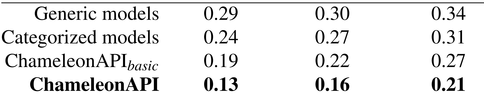

## Image classification applications
To run image classification apps, go to path ``` chameleonAPI_code_artifact/image_classification ```. 

First, download the trained models and evaluation datasets from s3 by: 

``` wget https://s3-us-east-2.amazonaws.com/chameleonapi/image_classification_models.zip ```

Then, unzip it (put under the path```chameleonAPI_code_artifact/image_classification ```).

Now, reproduce the accuracy of True-False applications in the paper by running:

``` python run_tf.py```

To reproduce the accuracy of Multi-Choice applications in the paper, run: 

``` python run_mc.py  ```


To reproduce the accuracy of Multi-Select applications in the paper, run: 

``` python run_ms.py  ```

After running these scripts, you should be able to get the following CSVs in the ```results``` folder under  ```chameleonAPI_code_artifact/image_classification ```:
results_\<Type of APP\>_our.csv, results_\<Type of APP\>_pretrained.csv,results_\<Type of APP\>_baseline.csv, results_\<Type of APP\>_spec.csv

Where \<Type of APP\> can be TF, multi_choice, multi_select


## Object detection applications

To run object detection apps, go to path ``` chameleonAPI_code_artifact/object_detection ```

First, download the trained models and evaluation datasets from s3 by: ``` wget https://s3-us-east-2.amazonaws.com/chameleonapi/object_detection_models.zip ```

Then, unzip it (put under the path ```chameleonAPI_code_artifact/object_detection ```).

Now, reproduce the accuracy of the applications by running: 

``` python run.py ```

After running these scripts, you should be able to get the following CSVs in the ```results``` folder under  ```chameleonAPI_code_artifact/image_classification ```:
results_our.csv, results_pretrained.csv, results_baseline.csv, results_spec.csv


## Text topic classification applications
To run object detection apps, go to path ``` chameleonAPI_code_artifact/nlp/transformers/examples/pytorch/text-classification/ ```

First, download the trained models and evaluation datasets from s3 by: ``` wget https://s3-us-east-2.amazonaws.com/chameleonapi/nlp_models.zip ```

Then, unzip it (put under the path ```chameleonAPI_code_artifact/nlp/transformers/examples/pytorch/text-classification/ ```).


Now, reproduce the accuracy of True-False applications in the paper by running:

``` python run.py```

To reproduce the accuracy of Multi-Choice applications in the paper, run: 

``` python run_mc.py  ```


After running these scripts, you should be able to get the following CSVs in the ```results``` folder under  ```chameleonAPI_code_artifact/image_classification ```:
results_\<Type of APP\>_our.csv, results_\<Type of APP\>_pretrained.csv,results_\<Type of APP\>_baseline.csv, results_\<Type of APP\>_spec.csv

Where \<Type of APP\> can be tf, mc.


## Getting Table 3
After running the above commands, you can get the summary by running ```python scripts/draw_table.py ``` under the root path ``` <YOUR PATH TO THE GITHUB REPO>/chameleonAPI/ ```

You will see the output 